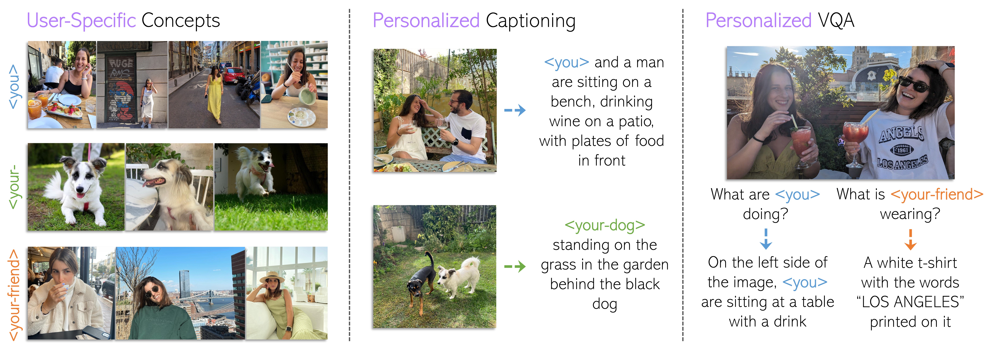
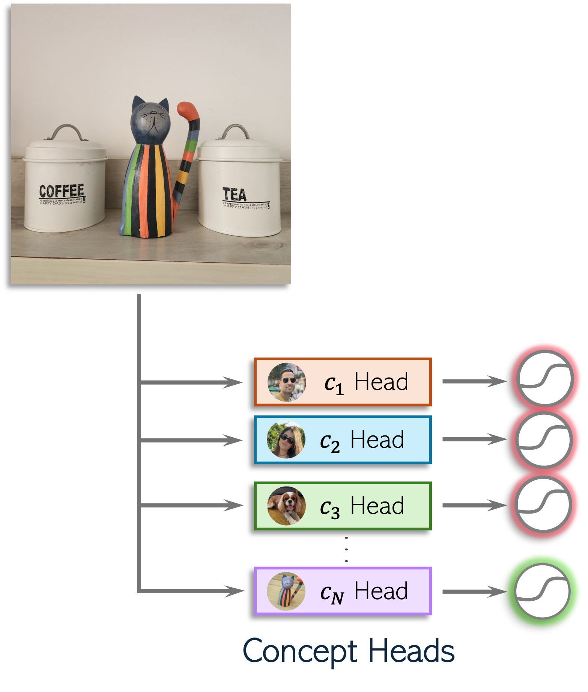
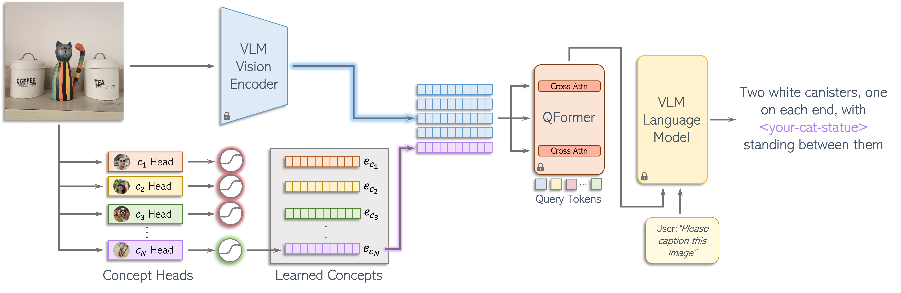
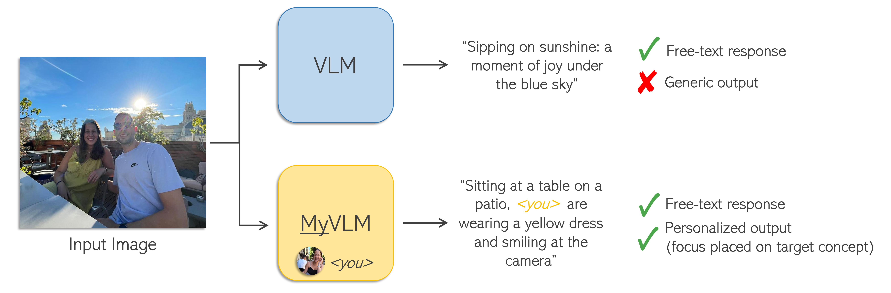

# MyVLM: Personalizing VLMs for User-Specific Queries 

> Recent large-scale vision-language models (VLMs) have demonstrated remarkable capabilities in understanding and generating textual descriptions for visual content. However, these models lack an understanding of user-specific concepts. In this work, we take a first step toward the personalization of VLMs, enabling them to learn and reason over user-provided concepts. For example, we explore whether these models can learn to recognize you in an image and communicate what you are doing, tailoring the model to reflect your personal experiences and relationships. To effectively recognize a variety of user-specific concepts, we augment the VLM with external concept heads that function as toggles for the model, enabling the VLM the identify the presence of specific target concepts in a given image. Having recognized the concept, we learn a new concept embedding in the intermediate feature space of the VLM. This embedding is tasked with guiding the language model to naturally integrate the target concept in its generated response. We apply our technique to BLIP-2 and LLaVA for personalized image captioning and further show its applicability for personalized visual question-answering. Our experiments demonstrate our ability to generalize to unseen images of learned concepts while preserving the model behavior on unrelated inputs.

<a href="https://arxiv.org/abs/2403.14599"></a>
<a href="https://snap-research.github.io/MyVLM/"></a> 
<a href="https://www.youtube.com/watch?v=8Fy17kK_aZY&ab_channel=YuvalAlaluf"></a> 

<p align="center">
  
<br>
Given a set of images depicting user-specific concepts such as &lt;you&gt;, &lt;your-dog&gt;, and &lt;your-friend&gt; (left), we teach a pretrained vision-language model (VLM) to understand and reason over these concepts. First, we enable the model to generate personalized captions incorporating the concept into its output text (middle). We further allow the user to ask subject-specific questions about these concepts, querying the model with questions such as "What are &lt;you&gt; doing?" or "What is my &lt;your-friend&gt; wearing?" (right).
</p>


# Description  
Official implementation of our MyVLM personalization paper.


# Table of Contents
- [Description](#description)
- [Table of Contents](#table-of-contents)
- [Setup](#setup)
  * [Environment](#environment)
- [Dataset & Pretrained Concept Heads](#dataset---pretrained-concept-heads)
- [Concept Heads](#concept-heads)
- [Concept Embeddings](#concept-embeddings)
  * [Data Setup](#data-setup)
    + [Optional: Generating Additional VQA Data for LLaVA](#--optional--generating-additional-vqa-data-for-llava--)
  * [Concept Embedding Training](#concept-embedding-training)
    + [BLIP-2: Captioning](#blip-2--captioning)
    + [LLaVA: Captioning & VQA](#llava--captioning---vqa)
    + [MiniGPT-v2: Captioning & Referring Expression Comprehension](#minigpt-v2--captioning---referring-expression-comprehension)
- [Inference](#inference)
  * [Original VLM Captioning](#original-vlm-captioning)
  * [MyVLM Inference](#myvlm-inference)
- [Acknowledgements](#acknowledgements)
- [Citation](#citation)


# Setup

## Environment
To set up the environment with all necessary dependencies, please run:
```
conda env create -f environment/environment.yaml
conda activate myvlm
```

# Dataset & Pretrained Concept Heads
As part of our code release, we have also released our object dataset introduced in the paper. This contains 29 user-specific objects, each containing ~10 images and 5 corresponding personalized captions for each image. 

The full dataset can be downloaded from [Google Drive](https://drive.google.com/drive/folders/1dxjwYVAmBRWLeqUjWsR8cWdqMvfsqW79?usp=sharing) or [HuggingFace](https://huggingface.co/datasets/yuvalalaluf/MyVLM).
Please note that our dataset is available under a non-commercial license (see `LICENSE` for details.)

A pretrained concept head and concept embedding for each object can also be downloaded from [Google Drive](https://drive.google.com/drive/folders/1qnBWDv1l9JFEG_7HGPtfnZyhBerRknP9?usp=sharing) or [HuggingFace](https://huggingface.co/yuvalalaluf/MyVLM), also under the same license.  
These can be loaded using the `CLIPConceptHead` class and our inference scripts for reproducing the paper results.


# Concept Heads

<p align="center">
  
<br>
For each user-specific concept, we introduce an external concept head designed to identify the presence of the concept within an image.
</p>


As mentioned in the paper, we have two types of concept heads: 
1. A facial recognition model for recognizing individuals
2. A CLIP-based concept head for recognizing user-specific objects

For faces, we use the `buffalo_l` face detection and face recognition model from [insightface](https://github.com/deepinsight/insightface/tree/master).
See `concept_heads/face_recognition/head.py` for usage.

For objects, we train a single linear layer over features extracted from a CLIP ViT-H/14 model (`DFN5B-CLIP-ViT-H-14-384`).
See `concept_heads/clip/head.py` for usage. 

Training a new concept head for objects can be done using `concept_heads/clip/train.py`, using the following command: 
```
python concept_heads/clip/train.py \
--config_path example_configs/concept_head_training.yaml
```
Please see `concept_heads/clip/config.py` for all available parameters. The important parameters are: 
1. `concept_name`: the name of the concept we wish to train a concept head for.
2. `positive_samples_path`: the directory containing all the positive samples. This directory should contain a sub-directory with
   the concept name (e.g., `<positive_samples_path>/<concept_name>`).
3. `negative_samples_path`: similar to above, the directory containing all the negative samples. This can be a set of negative samples that are downloaded from the internet, as was done in the paper.
4. `n_positive_samples`: how many positive samples we want to sample from the positive samples directory. By default, we use `4` samples.  
All remaining parameters can likely remain using the default values.

Logs will be saved to `<output_dir>/<concept_name>`. Please note that we only save the parameters of the 
trained linear layer, and not the entire model.


# Concept Embeddings

<p align="center">
  
<br>
Having identified the presence of a user-specific concept within an image, a learned concept embedding representing an object or individual is used to guide the LLM in incorporating the concept into its personalized textual response.
</p>

## Data Setup
First, we describe how to prepare your data for training the concept embedding.
Your data should be organized using the following structure:
```
data_root
├── <concept_name>
│   ├── <image1>.jpg
│   ├── <image2>.jpg
│   ├── ...
│   ├── captions.json (or captions_augmented.json)
│   └── additional_llava_vqa_data.json  (optional, used for personalized VQA using LLaVA, see next section).
└── <concept_name_2>
```
That is, the root directory should contain a sub-directory for each concept. Then, in each concept directory, you should have:
1. the set of images we want to use either for training or inference.
2. a `json` file containing the captions for each image, named `captions.json` or `captions_augmented.json`. 
This file should be in the following format:
```
{
    "<image1>.jpg": ["<caption1>", "<caption2>", ...],
    "<image2>.jpg": ["<caption1>", "<caption2>", ...],
    ...
}
```
That is, we have a dictionary mapping each image path to a list of target captions. 
As described in the paper, at each optimization step we will randomly sample a caption from this list to use as the target caption for the image.


### Optional: Generating Additional VQA Data for LLaVA
If we wish to perform personalized VQA using LLaVA as presented in the paper, you should also have an additional `json` file 
containing additional questions and answers for each image. 

This can be created using the script `inference/generate_augmented_vqa_data.py`, which will save everything in the correct format.

For example, you can run: 
```
python inference/generate_augmented_vqa_data.py \
--concept_name "Alex" \
--concept_identifier "Alex" \
--concept_class "the man" \  
--concept_type PERSON \         # either OBJECT or PERSON
--images_root /path/to/images
```
Please see `generate_augmented_vqa_data.py` for more information on the arguments that should be passed to the script.


## Concept Embedding Training
Below, we detail how to train the concept embedding for the various VLM models and personalization tasks 
presented in the paper.

Training embeddings for all VLMs and all personalization tasks can be done using the same script:
```bash
python concept_embedding_training/train.py \
--config_path example_configs/<VLM_TYPE>/<CONFIG_NAME>
```
where you should change `<VLM_TYPE>` to the VLM model you wish to train the concept embedding for and `<CONFIG_NAME>` to the name of the configuration file you wish to use. You can take a look at the various examples we have prepared in `example_configs`.

Please see `configs/train_config.py` for all available parameters. The important parameters that should be modified are: 
1. `concept_name`: the name of the concept we wish to train the embedding for.
2. `concept_identifier`: the identifier we wish to use the concept (e.g., `sks` for objects or a short name for people, e.g., `Bob` or `Anna`).
      - We will replace all instances of `concept_name` in the caption with `concept_identifier` during training. 
      - If working with people, we will replace all instances of `concept_name.title()` with `concept_identifier`. 
3. `concept_type`: which type of concept we are training for, either an `OBJECT` or `PERSON`.
4. `vlm_type`: which VLM we want to use, which should be one of `BLIP2`, `LLAVA`, or `MINIGPT_V2`.
5. `personalization_task`: which personalization task we want to perform. Please note that we currently tested only the following 
    combination of VLMs and personalization tasks:
    - `BLIP2`: `CAPTIONING`
    - `LLAVA`: `CAPTIONING`, `VQA`
    - `MINIGPT_V2`: `CAPTIONING`  
    You may be able to try different combinations, but these have not been tested.
6. `output_root`: where to save the outputs to. The exact output directory will be: `<output_root>/<concept_name>/seed_<seed>`.
7. `data_root`: the path to the data. Please see above for how the data should be organized.
8. `concept_head_path`: if working with objects, this should be the directory holding all the concept heads. This should have 
    a sub-directory for the concept we want to personalize.
9. `optimization_steps`: how many optimization steps to perform. Please see the Appendix of the paper for the number of steps we used for each VLM and task.
10. `batch_size`: the batch size to use for training. We typically use between `1` to `4` training samples.
11. `reg_lambda`: the lambda value to use for the attention-based regularization. These are already defined to their correct values in the example configs.
12. `seed`: random seed used for training. If working with objects, this should be the same seed used for training the concept head.

The remaining parameters can likely remain using the default values, but please see `configs/train_config.py` for more details.

This training script will save two outputs: 
1. A `pt` file containing the checkpoints of the trained concept embedding. This will be saved to `concept_embeddings_<VLM_TYPE>_<TASK>.pt`.  
    This is saved in the following format:
    ```
    {
      10: {
        "keys": torch.Tensor(),    # the keys used for optimizing the concept embedding
        "values": torch.Tensor(),  # the concept embedding itself
      },
      ...
      20: {
        "keys": torch.Tensor(),    
        "values": torch.Tensor(),  
      },
      ...
    }
    ```
    where each entry in the dictionary represents a different checkpoint during the optimization process.

2. A `json` file containing the inference results on all validation images, named `inference_outputs_<VLM_TYPE>_<TASK>.json`.
   - By default, we will run on the language instructions defined in `myvlm/common.py` (in `VLM_TO_PROMPTS`). Feel free to expand this list to include more prompts. 
   - Please see [MyVLM Inference](#myvlm-inference) for more details on the output format.


### BLIP-2: Captioning
For BLIP-2, we provide support for personalized captioning using:
```bash
python concept_embedding_training/train.py \
--config_path example_configs/blip2/concept_embedding_training_captioning.yaml
```


### LLaVA: Captioning & VQA
For training the embedding for personalized captioning with LLaVA, please follow: 
```bash
python concept_embedding_training/train.py \
--config_path example_configs/llava/concept_embedding_training_captioning.yaml
```

For personalized VQA with LLaVA, please follow: 
```bash
python concept_embedding_training/train.py \
--config_path example_configs/llava/concept_embedding_training_vqa.yaml
```
To match the scheme used in the paper, please make sure that you create the additional VQA data as described above 
([Optional: Generating Additional VQA Data for LLaVA](#--optional--generating-additional-vqa-data-for-llava--)). The training process will load this data and integrate it into the optimization process.


### MiniGPT-v2: Captioning & Referring Expression Comprehension

Before running MyVLM with MiniGPT-v2, you need to perform the following steps: 
1. Update the `HF_TOKEN_FOR_LLAMA` field in `myvlm/common.py` to your Hugging Face API token. This is required for downloading the LLama-2 LLM model from huggingface. If you need access to LLama-2, you should request access [here](https://huggingface.co/meta-llama/Llama-2-7b-chat-hf).
2. Download the pretrained `minigptv2_checkpoint.pth` model from [here](https://drive.google.com/file/d/1aVbfW7nkCSYx99_vCRyP1sOlQiWVSnAl/view).
    - This is taken from the official MiniGPT-v2 repository [here](https://github.com/Vision-CAIR/MiniGPT-4).
    - After downloading the model, update the path defined in `myvlm/common.py` in the variable `MINIGPT_V2_CKPT_PATH`.


For personalized captioning using MiniGPT-v2, please follow: 
```bash
python concept_embedding_training/train.py \
--config_path example_configs/minigpt_v2/concept_embedding_training_captioning.yaml
```
You may need to increase the number of iterations for personalized captioning with MiniGPT-v2. 
This will perform inference on both the captioning and referring expression comprehension personalization tasks.


# Inference
<p align="center">
  
<br>
VLMs possess <i>generic</i> knowledge, lacking a personal touch. With MyVLM we equip these models with the ability to comprehend user-specific concepts, tailoring the model specifically to <i>you</i>. 
MyVLM allows users to obtain personalized responses where outputs are no longer generic, but focus on communicating information about the target subject to the user.
</p>


## Original VLM Captioning
If you wish to run captioning using the original VLMs, you can do so using the following command: 
```bash
python inference/generate_original_captions.py \
--images_root /path/to/images \
--vlm_type <VLM_TYPE>
```
where `<VLM_TYPE>` is one of `BLIP2`, `LLAVA`, and `MINIGPT_V2`.

You can also run inference using: 
```bash
python inference/generate_original_captions.py \
--config_path example_configs/inference/original_vlm_inference.yaml
```

Please note that this script can likely be extended to run inference on other tasks/prompts by changing the input language 
instruction that is defined in Line 56: 
```python
inputs = vlm_wrapper.preprocess(image_path, prompt=VLM_TYPE_TO_PROMPT[cfg.vlm_type])
```


## MyVLM Inference
After training the concept heads and concept embeddings, you can run inference on a new set of images using: 
```bash
python inference/run_myvlm_inference.py \
--config_path example_configs/inference/myvlm_inference.yaml
```

All parameters are defined in `configs/inference_config.py` and closely follow the parameters defined in the training config detailed above.
The main parameters that should be modified are:
1. `concept_name`: same as above.
2. `concept_identifier`: same as above.
3. `concept_type`: same as above.
4. `vlm_type`: same as above.
5. `personalization_task`: same as above.
6. `image_paths`: either (1) a list of paths we want to run inference on; or (2) the directory containing the images we want to run inference on.
7. `checkpoint_path`: the path to all the trained concept embedding. This should contain a sub-directory for each concept and seed (e.g., `<output_root>/<concept_name>/seed_<seed>`).
8. `concept_head_path`: if working with objects, this should be the directory holding all the concept heads and seeds (e.g., `<concept_head_path>/<concept_name>/seed_<seed>`).
9. `seed`: random seed. This should be the same as used for the concept head and embedding training.
10. `iterations`: which optimization steps to run inference on. If `None`, we will run on all the checkpoints that were saved during the optimization process.
11. `prompts`: a list of strings defining the prompts to use for inference. If `None`, we will use a default list that is defined in `myvlm/common.py` (in `VLM_TO_PROMPTS`).

The output results will be saved to `<checkpoint_path>/<concept_name>/seed_<seed>/inference_outputs/inference_outputs_<VLM_TYPE>_<TASK>.json`, in the following format:
```
{
    "iteration_10": {
        "image_path_1": {
            "prompt1": "caption1",
            "prompt2": "caption2",
            ...
        },
        "image_path_2": {
            "prompt1": "caption1",
            "prompt2": "caption2",
            ...
        },
        ...
    },
    "iteration_20": {
        ...
    },
  ...
}
```


# Acknowledgements 
This code builds on code from the following repositories: 
- [Transformers](https://github.com/huggingface/transformers): we use the `transformers` library for various model architectures, including CLIP and BLIP-2.
- [LLaVA](https://github.com/haotian-liu/LLaVA): the official implementation of LLaVA-1.6.
- [MiniGPT-v2](https://github.com/Vision-CAIR/MiniGPT-4): the official implementation of MiniGPT-v2.
- [GRACE](https://github.com/Thartvigsen/GRACE): official implementation of the GRACE model editing technique on which our original MyVLMLayer implementation was based.


# Citation
If you use this code for your research, please cite the following work:
```
@misc{alaluf2024myvlm,
      title={MyVLM: Personalizing VLMs for User-Specific Queries}, 
      author={Yuval Alaluf and Elad Richardson and Sergey Tulyakov and Kfir Aberman and Daniel Cohen-Or},
      year={2024},
      eprint={2403.14599},
      archivePrefix={arXiv},
      primaryClass={cs.CV}
}
```
